# 우아한 형제들 JWP 강의 - 박재성

## 1주차

### 어떻게 학습할 것인가?
* **단순 반복한다고 실력이 늘지 않는다**.  
* 의식적으로 무엇을 바꿔볼것인지, 개선할것인지 지속적으로 고민하고 실행하기  
* 같은 프로젝트를 매번 다시 만들어보되, 매번 다르게 만들어보기  
* 내가 왜 이 연습을 하는지, 연습포인트를 고민하고 시작하기  
* 옆에 사람이 한다고 따라가는게 가장 안좋다. 본인만의 속도와 방향으로 가라

### 단위테스트와 리팩토링
* 왜 단위 테스트와 리팩토링을 해야하는가?
  * 내가 천재가 아니다.
  * 되게 작은 부분부터 step by step 으로 진행하는 것이 더 효율적이다.
  * 한번에 크게 진행하다보면 오히려 머릿속이 꼬이게 된다.
  * 리팩토링은 설계다.
  * 테스트 코드가 있으면 이렇게 설계해볼까 저렇게 설계해볼까 여러 측면으로 **코드를 개선하면서도 안전성이 보장** 된다.
  * 기존에 브라우저 열고, DB 올린 뒤에 브라우저 위에서 테스트하는 것과 테스트 코드를 실행시키는 것중, 어느게 더 더 생산성이 좋은지는 자명

### 계산기 테스트 및 리팩토링 개발환경 구축하기

IntelliJ 프로젝트 생성

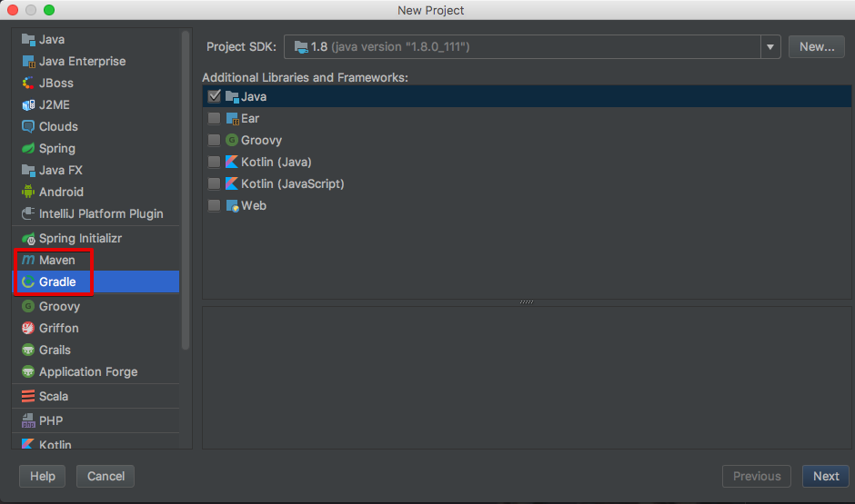

Junit 라이브러리를 사용해야하므로 직접 jar를 받아 추가하기 보다는 빌드도구를 사용해서 의존성을 쉽게 사용하는것이 좋다.  
Maven, Gradle 중 원하는 빌드 도구로 생성한다.  
(팀내 빌드도구를 선택하면 되지만, 박재성님의 강의는 Maven으로 진행할 예정)  

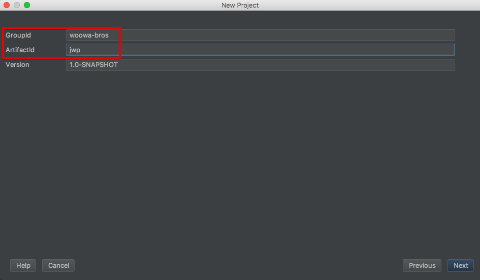

GroupId와 artifactId는 원하는 값을 입력하면 된다.  
(정식 프로젝트라면 룰에 맞춰서 가야하지만 테스트이니 그냥 한다.)  

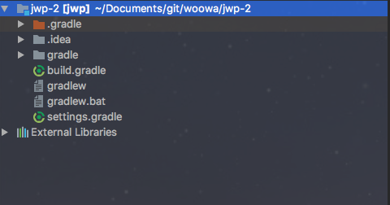

생성이 완료되면 위와 같은 프로젝트 구조가 생성된다.  
main 코드와 test 코드를 생성하기 위해 source root를 생성해야한다.  
(없으면 패키지 및 클래스가 생성되지 않는다.)  
main 코드의 source root를 생성하기 위해 프로젝트를 선택 -> ```command+n```을 눌러 directory를 선택 -> ```src/main/java```를 입력한다.  

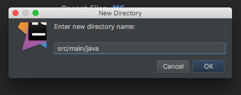

test도 마찬가지로 진행하되, ```src/test/java```를 입력한다.  

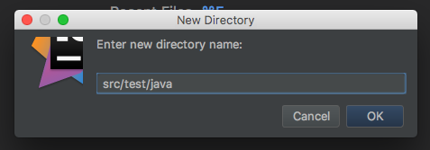

2개를 생성하면 아래와 같은 구조가 된다.  

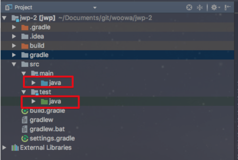

main의 소스루트는 파란색으로, test의 소스루트는 빨간색으로 표기되는데, 혹시나 잘못생성되어 아래와 같이 일반디렉토리(회색)로 되어있을 수 있다.  

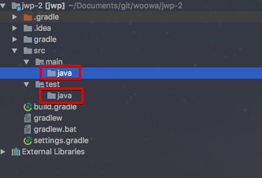

이럴 경우 main과 java 디렉토리를 우클릭하여 ```Mark Directory as``` -> ```Sources Root```를 선택한다.  

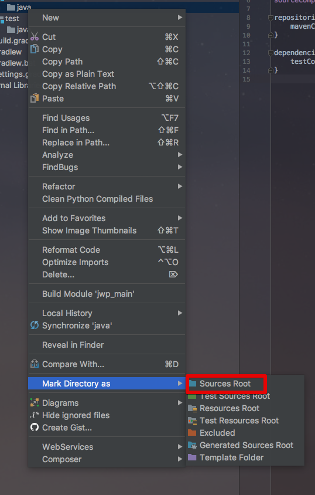

test도 마찬가지로 java 디렉토리를 우클릭하여 ```Mark Directory as``` -> ```Test Sources Root```를 선택한다.  

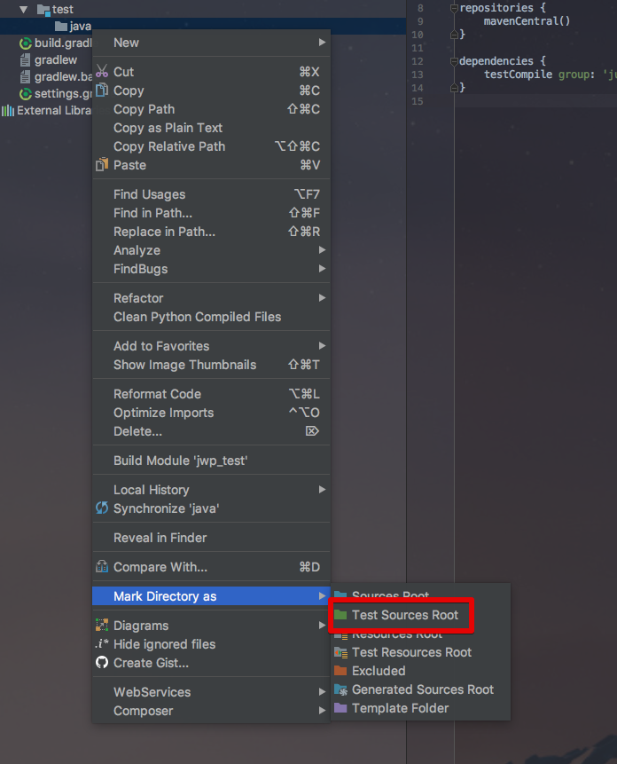

여기까지 완료되었으면 이제 바로 코드를 작성하면 된다.  

### 테스트 코드 생성
```src/test/java```에 패키지 및 클래스를 생성한뒤, 테스트코드 작성 -> main 코드 작성순으로 진행하면 된다.  

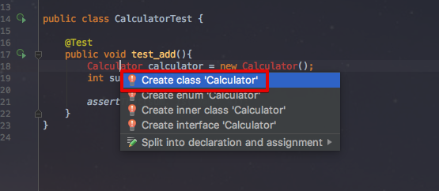

아직 main에 생성되지 않은 클래스를 사용하기 때문에 빨간 경고창이 출력되는데, 이때 해당 표기에서 ```option+enter```를 누르면 class를 생성할 수 있다.  

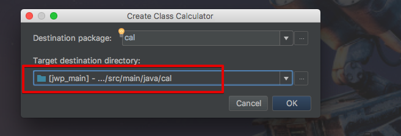

(클래스 생성 위치가 test로 잡힐텐데, main으로 변경해서 생성해야한다)  
  
이런식으로 **선 테스트코드 작성 -> 테스트 코드에 맞춰 메인코드 생성** 순으로 진행하면 된다.  
테스트 코드의 비교는 ```assertEquals, assertTrue, assertThat```등 여러개 있는데, 개인적으로 ```assertThat```추천  

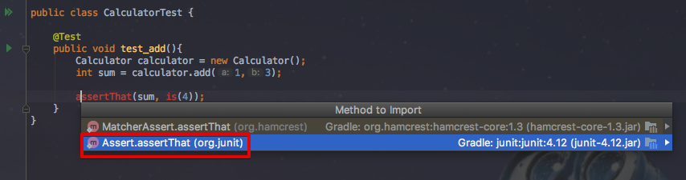

assertThat 관련 클래스가 import 안된 상태인데, 빨간색 표시에서 ```option+enter```를 입력하면 ```static import```가 가능하다. ```static import``` -> ```Assert.assertThat```을 선택하면 자동 import 된다.  
(IntelliJ에서 ```option+enter```는 **현재 코드에서 가능한 모든 action를 보여주는** 일을 한다고 보면 된다.  
가령, 미등록된 클래스를 사용한뒤, ```option+enter```을 사용하면 해당 클래스를 import 시키는 action을 보여주거나,  
java7 문법으로 작성한 코드를 람다식으로 변경하는 action을 보여주는 등)  
  
assertThat의 비교로 is역시 static import 한다.   

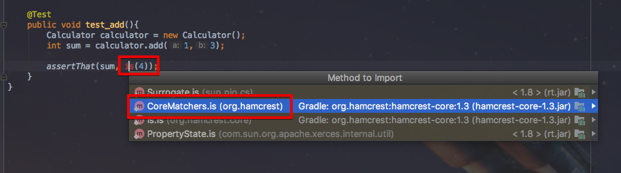

[assertEquals, assertThat 소개](http://whiteship.tistory.com/1739)